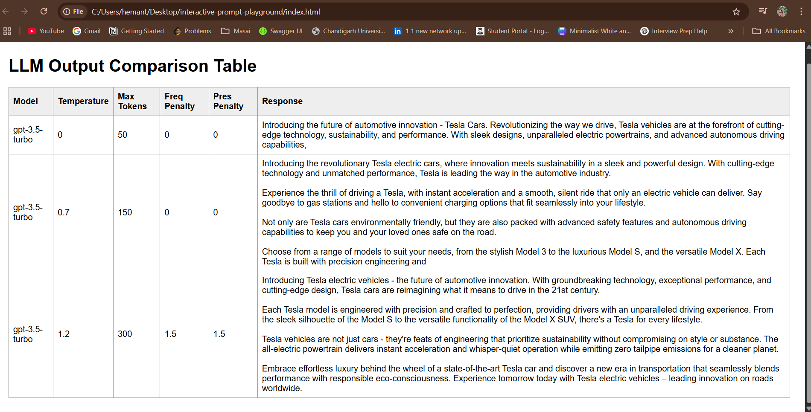

# Interactive Prompt Playground

A web-based playground for experimenting with different LLM (Large Language Model) parameters and comparing their outputs in real-time.

## Features

- Interactive interface to adjust LLM parameters:
  - Temperature
  - Max Tokens
  - Frequency Penalty
  - Presence Penalty
- Side-by-side comparison of model outputs
- Real-time response generation
- Clean, user-friendly interface

## Getting Started

1. Clone the repository
2. Install dependencies: `npm install`
3. Create a `.env` file and add your OpenAI API key:
   ```
   OPENAI_API_KEY=your_api_key_here
   ```
   Alternatively, you can directly replace the API key in playground.js at openaiKey
4. Start the server: `node playground.js`
5. Open `index.html` in your browser

## Example Output

Here's an example of the output comparison table with different parameter settings:



The table shows how different parameter settings affect the model's responses, including variations in length, creativity, and content.

## Parameters Explained

- **Model**: The LLM model being used (e.g., gpt-3.5-turbo)
- **Temperature**: Controls randomness (0 = deterministic, higher = more creative/random)
- **Max Tokens**: Maximum length of the generated response
- **Freq Penalty**: Reduces repetition of the same phrases
- **Pres Penalty**: Encourages the model to talk about new topics

## License

This project is open source and available under the MIT License.
